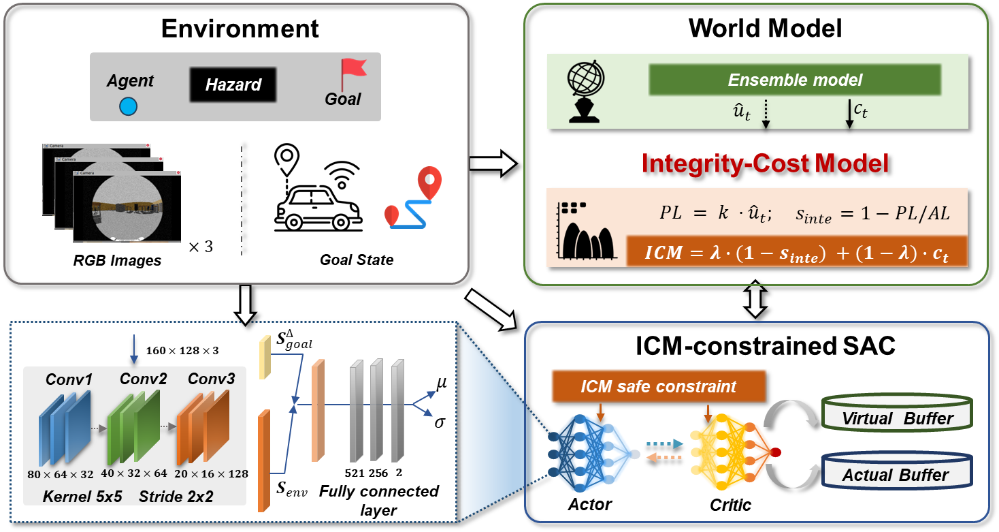

## Three papers and one workshop are accepted by ITSC 2025

**Hong Kong – July 5, 2025** – TAS Lab is proud to announce its significant presence at the upcoming **2025 IEEE 28th International Conference on Intelligent Transportation Systems (ITSC 2025)**. The prestigious international conference, scheduled for November 18-21, 2025, in Gold Coast, Australia, will feature **three accepted research papers** and a **dedicated workshop** led by our research team. This exceptional achievement underscores our group's leadership and commitment to advancing cutting-edge solutions in the field of intelligent transportation.

ITSC is a premier global forum for researchers, practitioners, and policymakers to discuss the latest developments and challenges in intelligent transportation systems. Our strong showing at this year's conference reflects the caliber and impact of the research being conducted within our group.

Our accepted papers address critical advancements and innovative approaches across key areas of intelligent transportation:

* **Pioneering Enhanced Navigation in Urban Environments:** The paper titled "Enhancing LEO-GNSS Positioning in Urban Canyons: A Factor Graph Optimization Approach with StarLink Simulations" explores novel methodologies to significantly improve the accuracy of Global Navigation Satellite System (GNSS) positioning in challenging urban environments, particularly through the integration of Low Earth Orbit (LEO) satellite constellations like StarLink. This work is co-authored by Yixin GAO, Weisong WEN, Xikun LIU, Feng HUANG, jiahao HU, and Dongzhe SU.

  

    

* **Advancing Safe and Robust Autonomous Navigation:** Our research, "Integrity-Monitored Deep Reinforcement Learning for Safe and Robust Autonomous Navigation," focuses on developing sophisticated deep reinforcement learning techniques that incorporate integrity monitoring to ensure the safety and reliability of autonomous driving systems. This crucial work is a collaborative effort by Yuanyuan ZHANG, Yingying WANG, Baoshan, SONG, and Weisong WEN.

  

    

* **Establishing a Benchmark for Cooperative Urban Navigation:** The paper "UrbanV2X: A Multisensory Vehicle-Infrastructure Dataset for Cooperative Navigation in Urban Areas" introduces a comprehensive and unique multisensory dataset designed to facilitate and accelerate research in cooperative navigation for urban environments, leveraging Vehicle-to-Everything (V2X) communication. The extensive list of contributors includes Qijun QIN, Ziqi Zhang, Yihan Zhong, Feng Huang, Xikun Liu, Runzhi Hu, Hang CHEN, Wei HU, Dongzhe Su, Jun Zhang, Hoi-Fung Ng, and Weisong Wen.

  

    

* In addition to these research papers, our group's commitment to fostering collaboration and discussion is highlighted by the acceptance of our workshop, "**4th Workshop on Intelligent Vehicle Meets Urban Safe and Certifiable Navigation and Control for Intelligent Vehicles in Complex Urban Scenarios**".This workshop will provide an invaluable platform for experts to converge and exchange ideas on ensuring the safety, reliability, and certifiability of intelligent vehicles operating in complex urban landscapes.

  

    

"We are incredibly proud of our team's success at ITSC 2025," says Weisong WEN."Having three papers accepted and leading a workshop at such a prominent conference is a testament to the dedication, innovation, and impactful research our team consistently delivers. We look forward to contributing to the global dialogue on intelligent transportation systems in Gold Coast".

TAS Lab remains at the forefront of research dedicated to creating safer, more efficient, and intelligent transportation solutions for the future.
