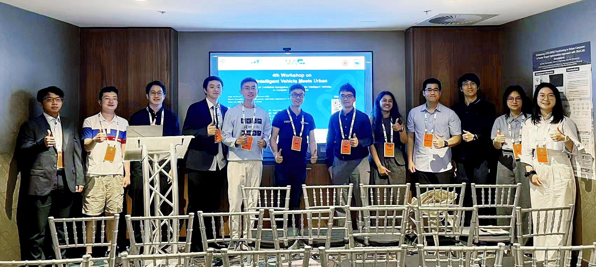
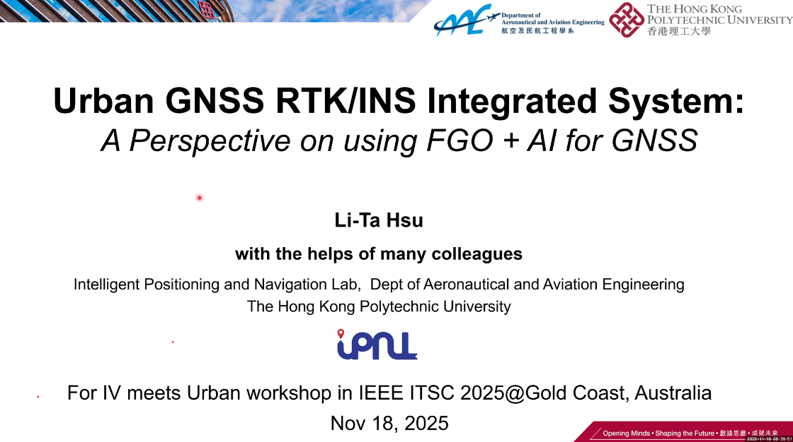
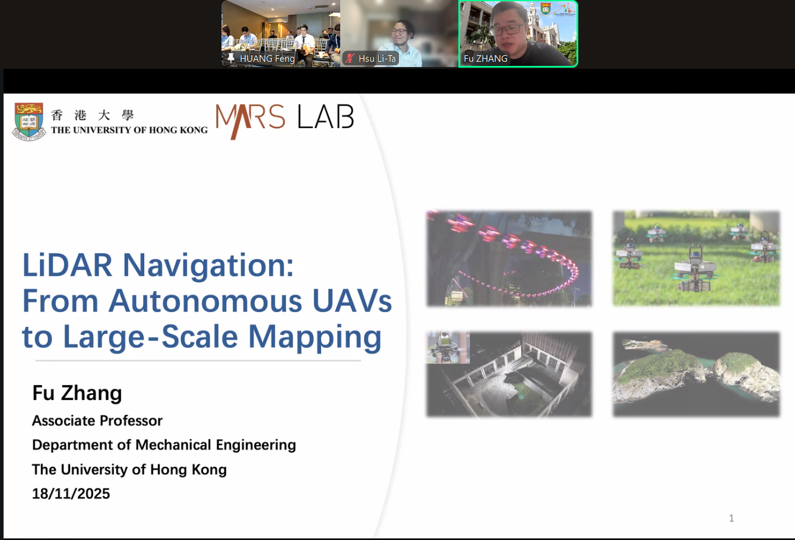
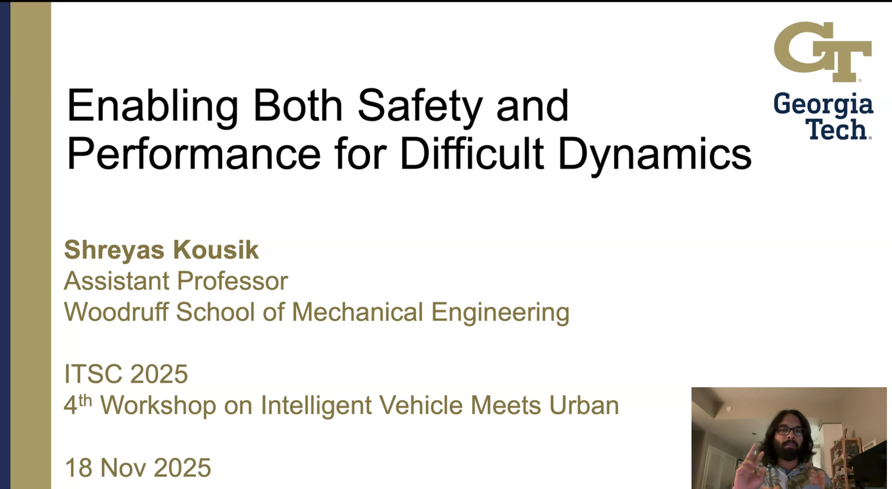

**GOLD COAST, AUSTRALIA – November 18, 2025 –** The **4th Workshop on Intelligent Vehicle Meets Urban: Safe And Certifiable Navigation And Control** was successfully held at the Star Grand, Broadbeach, Gold Coast, Australia, in conjunction with the ITSC 2025 conference. The event convened leading experts and researchers to address the critical challenges of ensuring **safe, robust, and certifiable autonomous navigation** in complex urban environments.

  

The workshop featured a series of high-impact presentations by renowned experts, whose contributions steered discussions on cutting-edge solutions for urban autonomy:

* **Prof. Li-Ta Hsu** (The Hong Kong Polytechnic University)
* **Prof. Timothy D Barfoot** (University of Toronto)
* **Prof. Fu Zhang** (The University of Hong Kong)
* **Prof. Yi Zhou** (Hunan University, China)
* **Dr. Mao Shan** (The University of Sydney)
* **Prof. Shreyas Kousik** (Georgia Institute of Technology)

<table style="width:100%; text-align:center;">
  <tr>
    <td style="width:33.3%; padding: 5px;">
      
    </td>
    <td style="width:33.3%; padding: 5px;">
      
    </td>
    <td style="width:33.3%; padding: 5px;">
      
    </td>
  </tr>
  <tr>
    <td style="width:33.3%; padding: 5px;">
      
    </td>
    <td style="width:33.3%; padding: 5px;">
      
    </td>
    <td style="; padding: 5px;">
      
    </td>
  </tr>
</table>

Their talks covered essential topics from high-precision multi-sensor fusion and radar-based navigation to formal safety methods and LiDAR-centric systems for drones.

A key highlight of the event was the dynamic poster session. Colleagues from our research group and Zhenxing Ming from University of Sydneey presented their latest findings, contributing significantly to the dialogue on next-generation intelligent vehicles. Their exhibited works covered areas such as robust localization, V2X data fusion, and integrity monitoring for autonomous navigation.

The 4th Workshop on Intelligent Vehicle Meets Urban was a resounding success, fostering collaboration and setting new directions for research in safe and certifiable autonomous systems. The organizing committee extends its sincere gratitude to all invited speakers, poster presenters, and attendees for their active participation.

For the detailed schedule, invited speaker abstracts, and information on accepted posters and videos, please visit the official workshop page: **[4th Workshop on IV meets Urban](https://sites.google.com/view/ivurban2025itsc)**

